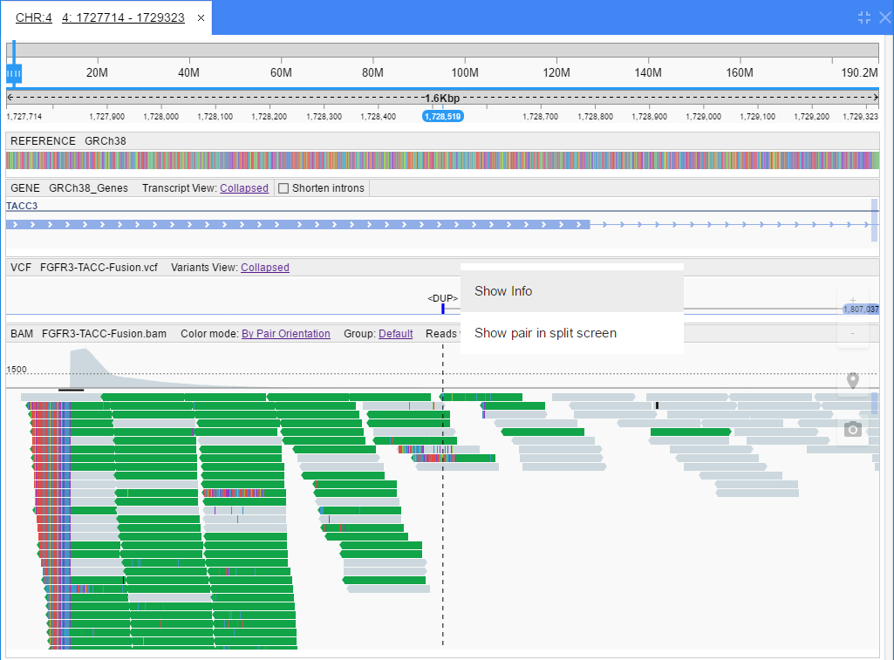
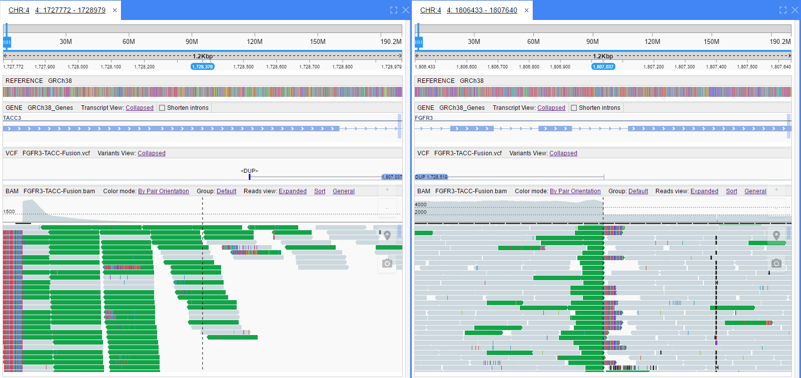
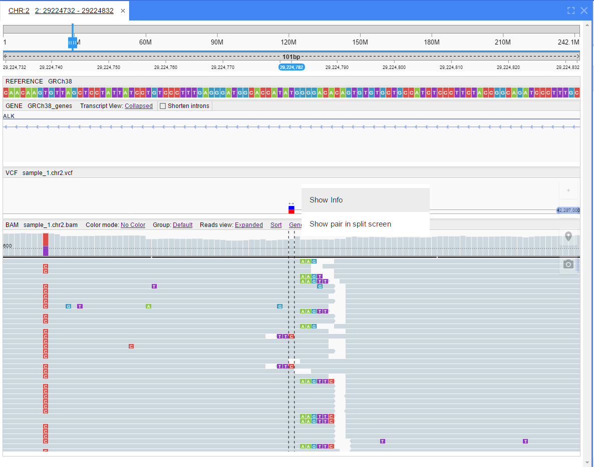

# Dataset visualization for article **Prioritisation of Structural Variant Calls in Cancer Genomes**

**New Genome Browser** was used to generate figures for the **[Prioritisation of Structural Variant Calls in Cancer Genomes article](http://biorxiv.org/content/early/2016/11/04/084640)**

Below are the details on how to reproduce visualization of the datasets, used in the article

Links to variations loci, provided below, will load public NGB instance located at [http://ngb.opensource.epam.com](http://ngb.opensource.epam.com/catgenome)

## Figure 5. FGFR3-TACC3 tandem duplication fusion

1. Navigate to [FGFR3-TACC3 fusion locus](http://ngb.opensource.epam.com/catgenome/#/GRCh38/4/1727714/1729323?rewrite=Off&tracks=%5B%7B%22h%22%3A20%2C%22s%22%3A%7B%7D%2C%22b%22%3A%22GRCh38%22%2C%22p%22%3A%22FGFR3-TACC-Fusion-Sample%22%7D%2C%7B%22h%22%3A53%2C%22s%22%3A%7B%22g%22%3A%22collapsed%22%7D%2C%22b%22%3A%22GRCh38_Genes%22%2C%22p%22%3A%22FGFR3-TACC-Fusion-Sample%22%7D%2C%7B%22h%22%3A41%2C%22s%22%3A%7B%22v%22%3A%22Collapsed%22%7D%2C%22b%22%3A%22FGFR3-TACC-Fusion.vcf%22%2C%22p%22%3A%22FGFR3-TACC-Fusion-Sample%22%7D%2C%7B%22h%22%3A475%2C%22s%22%3A%7B%22a%22%3Atrue%2C%22c%22%3A%22pairOrientation%22%2C%22c1%22%3Atrue%2C%22d%22%3Atrue%2C%22g1%22%3A%22default%22%2C%22i%22%3Atrue%2C%22m%22%3Atrue%2C%22r%22%3A1%2C%22s1%22%3Afalse%2C%22s2%22%3Atrue%2C%22s3%22%3Afalse%2C%22v1%22%3Afalse%7D%2C%22b%22%3A%22FGFR3-TACC-Fusion.bam%22%2C%22p%22%3A%22FGFR3-TACC-Fusion-Sample%22%7D%5D) *(click a link to navigate to a public NGB instance)*
2. DUP (duplication) variation and read evidence will be shown
3. Left-click a variation on a VCF track - context menu with two options will be shown
 * Show info
 * Show pair in split screen

4. Select **Show pair in split screen** to view second breakpoint of a duplication

5. Left-click a variation on a VCF track again and select **Show info**
6. Results of Structural Variation rearrangements will be shown (including protein domains coloring)

## Figure 6. ROS1-SLC34A2 interchromosomal translocation fusion

1. Navigate to [ROS1-SLC34A2 fusion locus](http://ngb.opensource.epam.com/catgenome/#/GRCh38/6/117336964/117337328?rewrite=Off&tracks=%5B%7B%22b%22%3A%22GRCh38%22%2C%22p%22%3A%22SV_Sample2%22%2C%22h%22%3A20%2C%22s%22%3A%7B%7D%7D%2C%7B%22b%22%3A%22GRCh38_Genes%22%2C%22p%22%3A%22SV_Sample2%22%2C%22h%22%3A122%2C%22s%22%3A%7B%22g%22%3A%22collapsed%22%7D%7D%2C%7B%22b%22%3A%22sample_2-lumpy.vcf%22%2C%22p%22%3A%22SV_Sample2%22%2C%22h%22%3A63%2C%22s%22%3A%7B%22v%22%3A%22Collapsed%22%7D%7D%2C%7B%22b%22%3A%22sv_sample_2.bam%22%2C%22p%22%3A%22SV_Sample2%22%2C%22h%22%3A410%2C%22s%22%3A%7B%22a%22%3Atrue%2C%22c%22%3A%22insertSize%22%2C%22c1%22%3Atrue%2C%22d%22%3Atrue%2C%22g1%22%3A%22chromosomeOfMate%22%2C%22i%22%3Atrue%2C%22m%22%3Atrue%2C%22r%22%3A0%2C%22s1%22%3Afalse%2C%22s2%22%3Atrue%2C%22s3%22%3Afalse%2C%22v1%22%3Afalse%7D%7D%5D) *(click a link to navigate to a public NGB instance)*
2. BND (breakends) variation with alignments will be shown. Variation tooltip indicates second breakpoint location (interchromosomal translocation chr6<->chr4)
3. Left-click a variation on a VCF track (lumpy) - context menu with two options will be shown
 * Show info
 * Show pair in split screen

4. Select **Show pair in split screen** to view second breakpoint of a translocation
*Note: this location looks better when colored by **Insert size**, grouped by **Chromosome of mate** and reads view set to **Collapsed** To enable these modes a BAM track header menu or hotkeys could be used (default are: SHIFT+2 to set color mode, SHIFT+F to set grouping and SHIFT+X to set collapsed reads view)*

5.  Left-click a variation on a VCF track again and select **Show info**
6. Results of Structural Variation rearrangements will be shown (including protein domains coloring)
*Note: there are two genes located at chr6 breakpoint, that's why two options would be shown in details window - which gene two use when renedering a visualization of rearrangement. ROS1 should be selected*

## Figure 7. EML4-ALK inversion fusion

1. Navigate to [EML4-ALK fusion locus](http://ngb.opensource.epam.com/catgenome/#/GRCh38/2/29224570/29224993?rewrite=Off&tracks=%5B%7B%22b%22%3A%22GRCh38%22%2C%22p%22%3A%22SV_Sample1%22%2C%22h%22%3A20%2C%22s%22%3A%7B%7D%7D%2C%7B%22b%22%3A%22GRCh38_Genes%22%2C%22p%22%3A%22SV_Sample1%22%2C%22h%22%3A55%2C%22s%22%3A%7B%22g%22%3A%22collapsed%22%7D%7D%2C%7B%22b%22%3A%22sample_1-lumpy.vcf%22%2C%22p%22%3A%22SV_Sample1%22%2C%22h%22%3A42%2C%22s%22%3A%7B%22v%22%3A%22Collapsed%22%7D%7D%2C%7B%22b%22%3A%22sv_sample_1.bam%22%2C%22p%22%3A%22SV_Sample1%22%2C%22h%22%3A462%2C%22s%22%3A%7B%22a%22%3Atrue%2C%22c%22%3A%22pairOrientation%22%2C%22c1%22%3Atrue%2C%22d%22%3Atrue%2C%22g1%22%3A%22default%22%2C%22i%22%3Atrue%2C%22m%22%3Atrue%2C%22r%22%3A1%2C%22s1%22%3Afalse%2C%22s2%22%3Atrue%2C%22s3%22%3Afalse%2C%22v1%22%3Afalse%7D%7D%5D) *(click a link to navigate to a public NGB instance)*
2. Inversion variation with alignments will be shown
3. Left-click a variation on a VCF track (lumpy) - context menu with two options will be shown
 * Show info
 * Show pair in split screen

4. Select **Show pair in split screen** to view second breakpoint of an inversion
*Note: this location looks better when colored by **Pair orientation** and sorted by **Insert size** . To enable these modes a BAM track header menu or hotkeys could be used (default are: SHIFT+1 to set color mode and SHIFT+Y to set sorting)*

5.  Left-click a variation on a VCF track again and select **Show info**
6. Results of Structural Variation rearrangements will be shown (including protein domains coloring)

